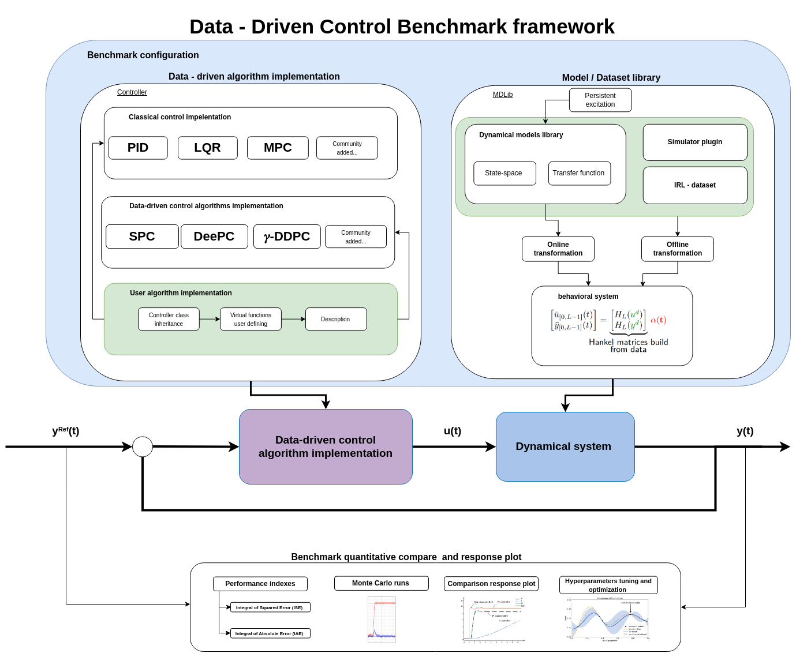

# csbenchlab
Benchmarking toolbox for evaluation, tuning and comparison of arbitrary controllers while controlling arbitrary dynamical systems.
Primarly developed in Python, CSBenchLab supports Matlab and Simulink backends and offers tools for making control system component [plugins](doc/Concepts.md)
and seamless plugin integration with the rest of the toolbox features.

## Language support
- Matlab
- Simulink
- Python

## Dependencies

### Python backend
- Python 3.8 or newer
- PyQt6
- numpy
- scipy
- matplotlib
- bdsim

### MATLAB/Simulink backend
- Matlab 2022b or newer
- Simulink coder
- MATLAB Engine API for Python

## Getting started
[Getting started guide](doc/GettingStarted.md)

## Examples
[Examples](doc/Examples.md)

